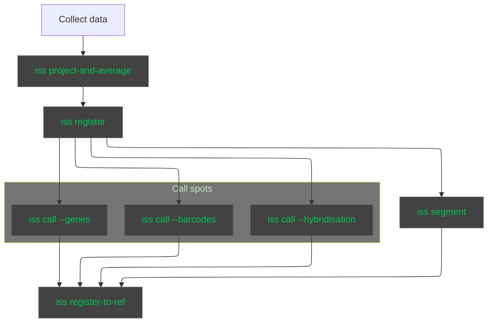

# ISS-preprocess
Utilities for image import, registration, spot localisation and base-calling for ISS data sets.

## Installation
First, clone the repository:
```
git clone git@github.com:znamlab/iss-preprocess.git
```

Next, navigate to the repo directory and create a conda environment and install dependencies by running:
```
conda env create --name iss-preprocess python=3.10
```

Finally, activate the new environment and install the package itself:
```
conda activate iss-preprocess
pip install -e .
```

## Usage

The main workflow is as follows:



For more information on the individual steps, see the [documentation](https://iss-preprocess.znamlab.org/).

## Getting started

To get started see the flexiznam documentation at https://flexiznam.znamlab.org/, in particular the "initial configuration" section.

Then refer to the [getting started page of the documentation](https://iss-preprocess.znamlab.org/) for more information.


## Development

### Building the documentation

To build the documentation you need to install extra dependencies, either by running:

```
pip install -e .[dev]
```

or using the requirement file:

```
pip install -r docs/requirements.txt
```

Then you can build the documentation locally by running:

```
sphinx-build docs/source docs/build
```

### Atlas cache

The registration to the allen reference atlas uses `bg_atlasapi` from brainglobe. This
keeps a cached version of the atlas in `~/.brainglobe` by default. This can be quite
big for high resolution atlases (10um per pixel). If using `nemo`, you might consider
linking that folder to save space in your home directory:
```
mkdir /camp/lab/znamenskiyp/home/users/<your user name>/brainglobe
ln -s /camp/lab/znamenskiyp/home/users/<your user name>/brainglobe .brainglobe
```

## Organisation of this repository

The purpose of this repo is to house scripts that will be used to preprocess image-based ISS data sets of multiple flavours (BARseq, INSTAseq etc.)

The broad strokes of the pipeline are:

* Estimation of illumination and channel brightness correction
* Registration of images between rounds of sequencing
* Estimation of bleedthrough matrices for sequencing and hybridisation rounds
* Localisation of spots across rounds
* Base-calling for each spot
* Alignment of spots across tiles and acquisitions (genes, hybridisation rounds, barcodes) into a global coordinate system
* Cell segmentation based on DAPI images
* Construction of a cell-barcode matrix

## Subpackages

* `io` - input and saving of image data and related metadata
* `reg` - code for stitching and registering images between rounds of sequencing
* `image` - image processing and correction routines
* `segment` - detecting ROIs and rolonies
* `call` - base-calling across rounds and constructing the cell/genes/barcode matrix output
* `config` - contains default pipeline settings
* `coppafish` - utilities adapted from coppafish codebase: hanning window, annulus for isolated
spot detection, and scaled k-means for bleedthrough estimation
* `pipeline` - high level routines for batch processing

## OMP pipeline

The pipeline uses orthogonal matching pursuit to identify gene rolonies. The approach
is loosely based on that used in this preprint https://www.biorxiv.org/content/10.1101/2021.10.24.465600v4
and implemented in https://github.com/jduffield65/iss.

First, bright rolonies are identified by looking for spots in a STD projection
of a sequencing round. The average fluorescence of each spot is fed into a simple
base caller, which uses a Gaussian Mixture Model to classify the 4 bases.

Sequences for each spot are them compared to a codebook to assign spots to genes.
Spots matching each gene (by default without any mismatches) are used to create
a dictionary to be used for Orthogonal Matching Pursuit.

OMP is then applied to each pixel to identify the genes present.
The algorithm works by iteratively. At each step we find the component that has
the highest dot product with the residual fluorescence signal. After selecting
a component, coefficients for all included components are estimated by least
squares regression and the residuals are updated. The component is retained
if it reduces the norm of the residuals by at least a fraction of the original
norm specified by a tolerance parameter.

The end product of the OMP algorithm is a series of images, containing coefficients
for each gene. We can now detect peaks in these images to find the location of
individual gene rolonies.

## Examples
Examples can be found in the `notebooks` subdirectory.
