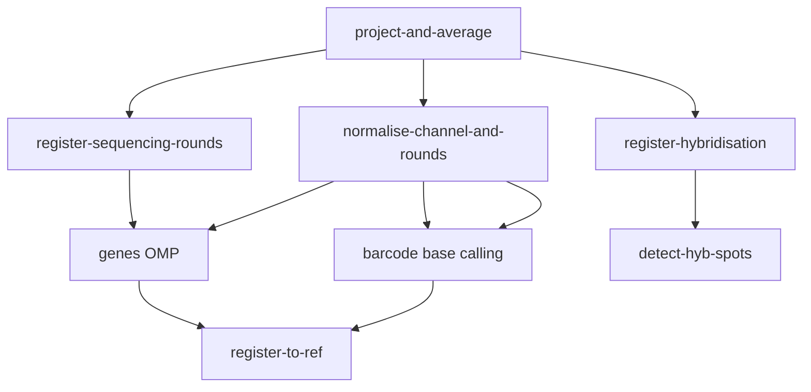

```mermaid
graph TD;
    A[project-and-average] --> B[register-sequencing-rounds];
    A --> C[normalise-channel-and-rounds];
    A --> D[register-hybridisation];
    D --> E[detect-hyb-spots];
    C --> F[genes OMP];
    B --> F;
    C --> G[barcode base calling];
    C --> G;
    F --> H[register-to-ref];
    G --> H;
```
