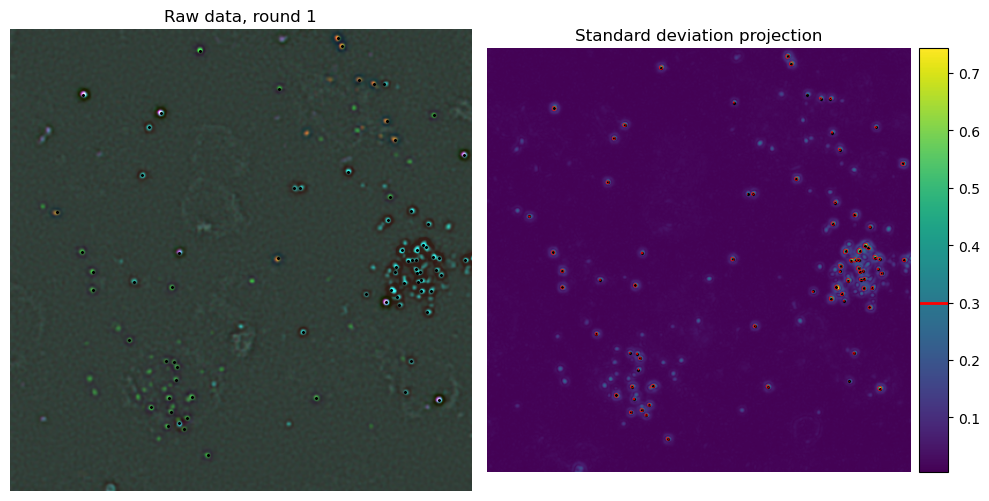
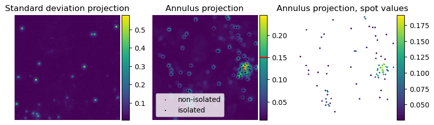
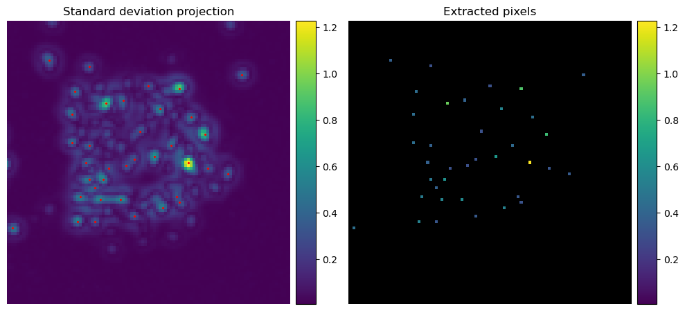
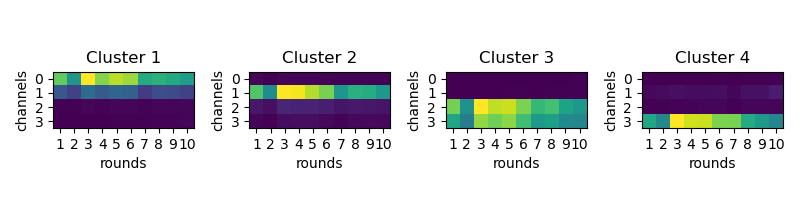
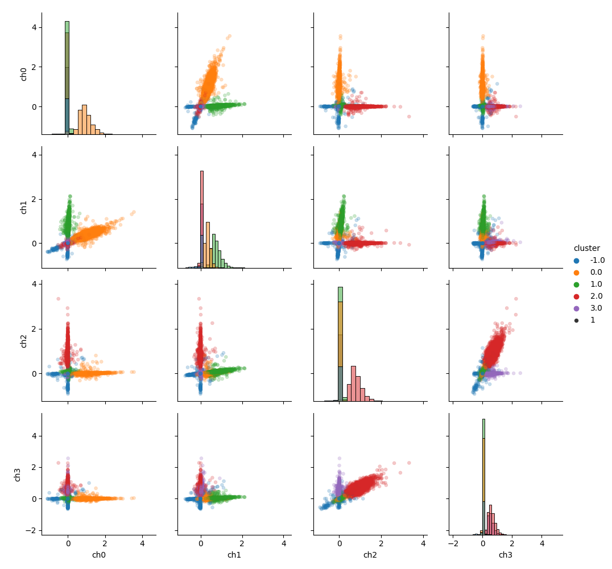

==============================
Bleedthrough matrix estimation
==============================

For both barcode and genes the first step is to generate bleed-through matrices for 
basecalling. This is done by using `iss setup-barcodes` and `iss setup-omp`.
The principles for both are the same and they both generate diagnostics plots (see 
final section of the page). Here we document the barcode setup.

Setup barcode calling
=====================

The aim is to find what is the fluorescence of each base. We determine this by 
detecting some isolated spots, extract their fluorescence value and cluster in 4
groups. This steps depend on 4 `ops` parameters:

- `barcode_ref_tiles` (default [ [ 1, 0, 0 ] ], must be changed)
- `barcode_detection_threshold` (default 0.3)
- `barcode_isolation_threshold` (default 0.3)
- `spots_extraction_radius`, shared with gene rounds (default 2)

To help setting the two threshold correctly, use `notebooks/select_spot_detection_thresholds.ipynb`.

Extracting isolated barcode spots
---------------------------------

Detecting barcode spots
^^^^^^^^^^^^^^^^^^^^^^^

All `barcode_ref_tiles` are processed sequencialy. They are loaded and registered 
between channel and rounds. Then a reference image is created by taking the standard
deviation of the stack. This image is used to detect spots by simple thresholding. 

Filtering isolated spots
^^^^^^^^^^^^^^^^^^^^^^^^

Extracting fluorescence values
^^^^^^^^^^^^^^^^^^^^^^^^^^^^^^

Cluster extracted data in 4 groups
----------------------------------

The detection/extraction steps are repeated for all `barcode_ref_tiles`. The resulting
data is then clustered in 4 groups using `coppafish` scaled k-means. Internally this is 
done in `iss.call.call.get_cluster_means`. 

The main output of the clustering is saved in `processed_path / "barcode_cluster_means.npy"`
The cluster assignement for each spot and their fluorescence values are saved in
`processed_path / "reference_barcode_spots.npz"` and used to generate diagnostics plots
described in the next section.

Plot diagnostics
----------------

The diagnostics plot are generated by `iss.pipeline.diagnostics.check_barcode_calling`,
which is called automatically by `iss setup-barcodes`. It generates one main figure
of the bleed-through matrices: `processed_path / figures / 'barcode_cluster_means.png'`.
This should hopefully look like this:

A further `nrounds` plots will be generated to help with debugging if the clustering 
went wrong. They are saved in the same folder and called `barcode_clusters_round_{x}.png` 
where `x` is the round number. 
Here is an example output of successful barcode calling:

