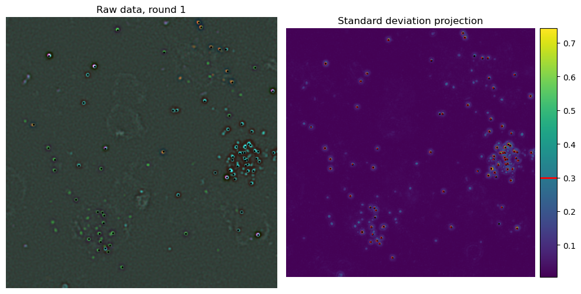

==============================
Bleedthrough matrix estimation
==============================

For both barcode and genes the first step is to generate bleed-through matrices for 
basecalling. This is done by using `iss setup-barcodes` and `iss setup-omp`.
The principles for both are the same. Here we document the barcode setup.

Setup barcode calling
=====================

The aim is to find what is the fluorescence of each base. We determine this by 
detecting some isolated spots, extract their fluorescence value and cluster in 4
groups. This steps depend on 4 `ops` parameters:

- `barcode_ref_tiles` (default [ [ 1, 0, 0 ] ], must be changed)
- `barcode_detection_threshold` (default 0.3)
- `barcode_isolation_threshold` (default 0.3)
- `spots_extraction_radius`, shared with gene rounds (default 2)

To help setting the two threshold correctly, use `notebooks/select_spot_detection_thresholds.ipynb`.

Detecting barcode spots
-----------------------

All `barcode_ref_tiles` are processed sequencialy. They are loaded and registered 
between channel and rounds. Then a reference image is created by taking the standard
deviation of the stack. This image is used to detect spots by simple thresholding. 

Filtering isolated spots
------------------------

.. image:: resources/barcode_spot_isolation.png
  :width: 900
  :alt: Filter barcode rolonies to select isolated ones

Extracting fluorescence values
------------------------------

.. image:: resources/barcode_spot_extraction.png
  :width: 700
  :alt: Extract barcode rolonies fluorescence values