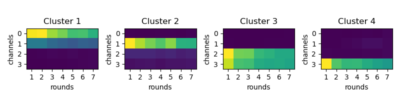
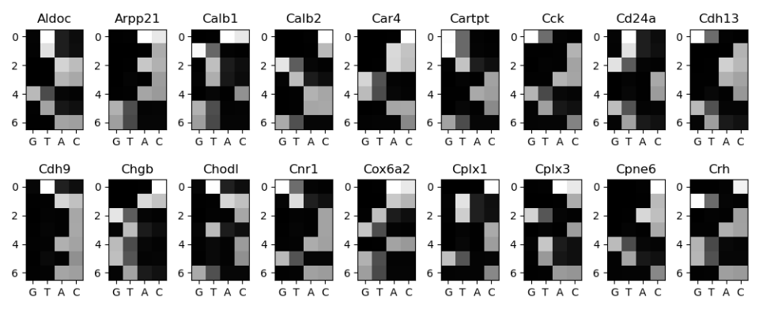

=====================
Calling various spots
=====================

Rolonies from genes, barcodes and hybridisation need to be identified and properly
labelled. This is done by :code:`iss call` but the process is different for each type of
spot.

*********************************
Detecting and decoding gene spots
*********************************

To detect the genes, we need to first estimate how much the fluoresence changes across
rounds and channels (channel correction). Then we can make a dictionary of expected
fluoresence for each gene (setup OMP) and finally run OMP on all tiles (extract tile).

.. mermaid::

    ---
    config:
    layout: elk
    look: handDrawn
    ---
    flowchart TD
    subgraph setup_channel_correction["setup_channel_correction"]
            est["estimate_channel_correction"]
    end
    subgraph subGraph1["Setup OMP"]
            setup_omp["setup_omp"]
            cos("check_omp_setup")
            coat("check_omp_alpha_thresholds")
            cot("check_omp_thresholds")
    end
        start["Start"] --> setup_channel_correction
        est --> setup_omp
        setup_omp --> cos & coat & cot & ext((("extract_tile")))
        est:::Sky
        setup_omp:::Sky
        cos:::Ash
        coat:::Ash
        cot:::Ash
        ext:::Sky
        classDef Ash stroke-width:1px, stroke-dasharray:none, stroke:#999999, fill:#EEEEEE, color:#000000
        classDef Sky stroke-width:1px, stroke-dasharray:none, stroke:#374D7C, fill:#E2EBFF, color:#374D7C

Gene dictionary estimation
==========================

The first step is to estimate the gene dictionary. This is done by finding what is the
fluoresence of each base for each round. :code:`check_omp_setup` will save a diagnostics
plot as `figures/sequencing/omp_cluster_means.png`. It should hopefully look like the
image below.

If it doesn't, check the :code:`figures/sequencing/omp_cluster_round_X.png` to get an
idea of what went wrong. Ensure you have enough tiles in `ops[f"genes_round_ref_tiles"]`
. If you still don't have enough spot, adjust `ops[f"{prefix}_detection_threshold"]`,
`ops[f"{prefix}_isolation_threshold"]`, and/or `ops["spot_extraction_radius"]`. If you
have enough data but the clustering is wrong, change `ops["initial_cluster_means"]` and
`ops["genes_cluster_score_thresh"]`.

We then build an expected fluoresence trace for each gene, by using the gene dictionary
(found in the `call` folder) and the bleedthrough matrices generated above.

If it looks different from what you expected, check that you have the correct
`ops["camera_order"]` and dictionary.

OMP algorithm
=============

Detecting gene spots
====================

***************************************
Detecting and basecalling barcode spots
***************************************

.. mermaid::

    flowchart TD
    start[Start] --> setup_channel_correction

        subgraph setup_channel_correction
            est[estimate_channel_correction]
        end

        est --> setup_barcode_calling

        setup_barcode_calling --> ext(((basecall_tile)))

Detecting barcode spots
=======================

The first step is to detect barcode spots in the images. This is done by computing the
average of the filtered image across round and channels. Spot candidates are then
detected with a simple threshold crossing using `ops["barcode_detection_threshold_basecalling"]`.
This threshold will be lower than that used to calculate bleed-through matrices as we
want to include as many rolonies as possible.

.. image:: resources/barcode_spot_detection_calling.png
    :alt: Barcode spot detection for base calling
    :align: center

Basecalling barcode spots
=========================

To sequence, we need to use the [bleedthrough matrices](bleedthrough.rst) previously computed.

For each round, the Nchannel x Ncluster bleedthrough matrix is normalized so that the
length of each cluster vector is 1 (rows in the image below).

.. image:: resources/barcode_normalize_bleedthrough.png
    :alt: Normalization of bleedthrough matrix for base calling
    :align: center

Then, we extract the fluoresence on each channel for each spot, normalize the length
of this vector and calculate the dot product of the spot vector with the cluster vector.
The cluster with the highest dot product is the base called for that spot.

.. image:: resources/barcode_cluster_score_calculation.png
    :alt: Dot product for base calling
    :align: center

Quality scores
==============

Dot product score
^^^^^^^^^^^^^^^^^

The main quality score is the dot product score. This is the dot product of the spot
fluoresence across each round with the idealised fluoresence trace, calculated from the
base called sequence and the bleedthrough matrices.

Sign spot score
^^^^^^^^^^^^^^^

Optionally, rolonies can be filtered by their spot sign score. In practice this has
not been extremely useful so far as most rolonies are too densely packed. This score
is an estimate of how much the spot has the same shape as an average isolated spot.
This just counts the number of pixels that are positive in the middle of the spot and
how many are negative in the surrounding.

First we need to take the average rolonie image and threshold it to make a spot sign
image. This threshold is set by `ops["spot_shape_threshold"]` (shared with genes spots)

.. image:: resources/barcode_spot_sign_image.png
    :alt: Barcode spot sign image
    :align: center

Then we calculate how many of the pixels around the rolonies have the same sign as the
spot sign image. There are a lot more negative pixels, to avoid that they dominate the
score too much, the relative weight of negative and positive pixels can be adjusted
with `ops["barcode_spot_rho"]`.

.. image:: resources/barcode_spot_score.png
    :alt: Barcode spot score image
    :align: center
