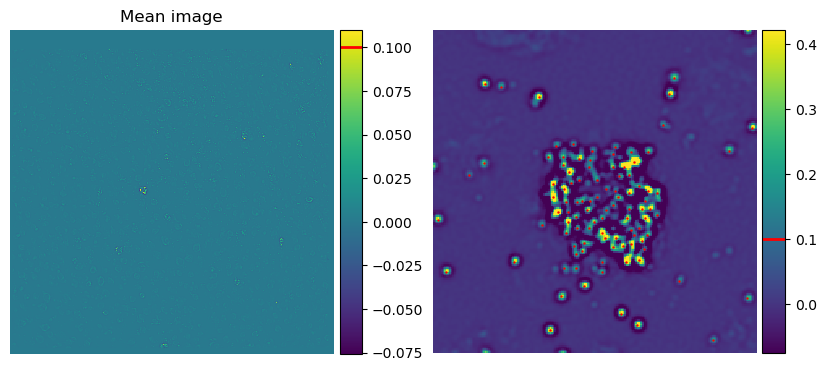
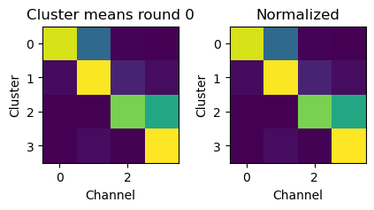
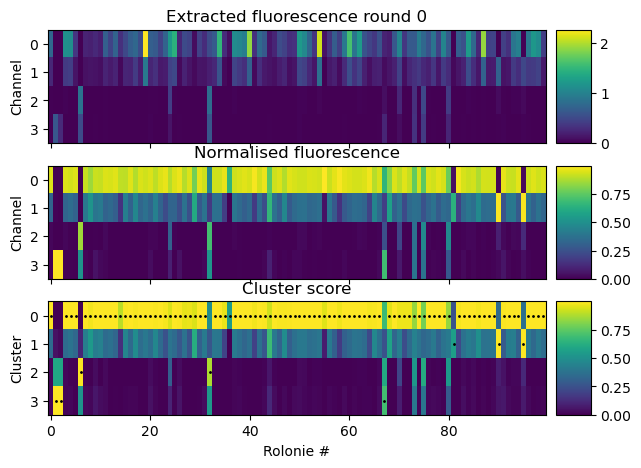
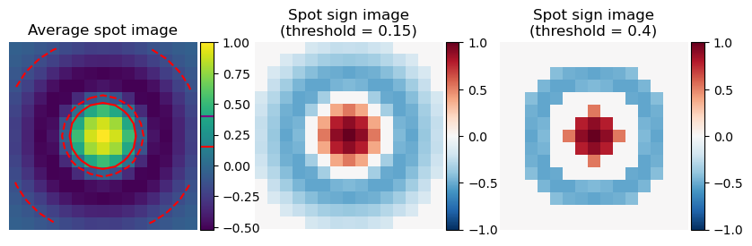
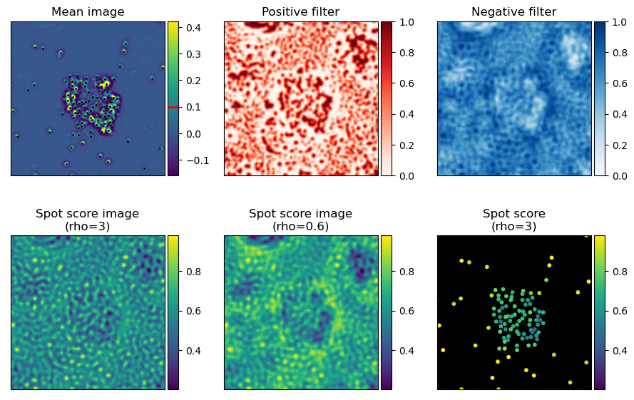

===========================
Gene and barcode sequencing
===========================

*********************************
Detecting and decoding gene spots
*********************************

Gene dictionary estimation
==========================

OMP algorithm
=============

Detecting gene spots
====================

***************************************
Detecting and basecalling barcode spots
***************************************

Detecting barcode spots
=======================

The first step is to detect barcode spots in the images. This is done by computing the
average of the filtered image across round and channels. Spot candidates are then
detected with a simple threshold crossing using `ops["barcode_detection_threshold_basecalling"]`.
This threshold will be lower than that used to calculate bleed-through matrices as we
want to include as many rolonies as possible.

Basecalling barcode spots
=========================

To sequence, we need to use the [bleedthrough matrices](bleedthrough.rst) previously computed.

For each round, the Nchannel x Ncluster bleedthrough matrix is normalized so that the
length of each cluster vector is 1 (rows in the image below).

Then, we extract the fluoresence on each channel for each spot, normalize the length
of this vector and calculate the dot product of the spot vector with the cluster vector.
The cluster with the highest dot product is the base called for that spot.

Quality scores
==============

Dot product score
^^^^^^^^^^^^^^^^^

The main quality score is the dot product score. This is the dot product of the spot
fluoresence across each round with the idealised fluoresence trace, calculated from the
base called sequence and the bleedthrough matrices.

Sign spot score
^^^^^^^^^^^^^^^

Optionally, rolonies can be filtered by their spot sign score. In practice this has
not been extremelly useful so far as most rolonies are too densely packed. This score
is an estimate of how much the spot has the same shape as an average isolated spot.
This just counts the number of pixels that are positive in the middle of the spot and
how many are negative in the surrounding.

First we need to take the average rolonie image and threshold it to make a spot sign
image. This threshold is set by `ops["spot_shape_threshold"]` (shared with genes spots)

Then we calculate how many of the pixels around the rolonies have the same sign as the
spot sign image. There are a lot more negative pixels, to avoid that they dominate the
score too much, the relative weight of negative and positive pixels can be adjusted
with `ops["barcode_spot_rho"]`.

